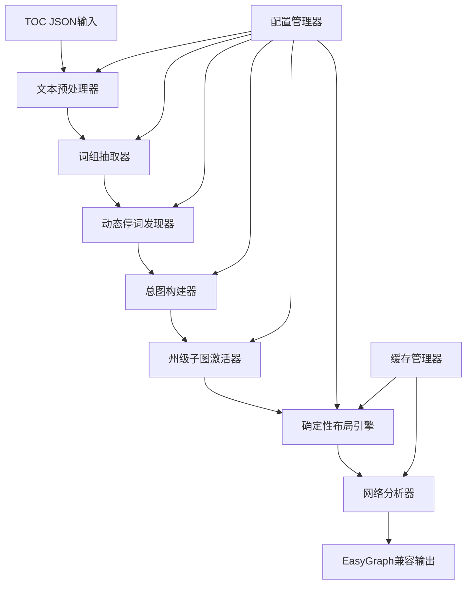

# 语义增强共词网络分析管线设计文档

## 概述

本设计文档描述了语义增强共词网络分析管线的架构和实现方案。系统采用"总图优先，州级激活"的两阶段构建策略，以词组/短语为节点单位，通过动态停词发现和确定性布局确保可复现的网络分析结果。

系统将处理TOC分段的政策/法规文档，构建跨文档的全局共现网络，然后通过激活掩码提取州级子图进行对比分析，最终为EasyGraph/OpenRank框架的图融合研究提供高质量的基础数据。

## 架构

### 整体架构



### 数据流架构


## 组件和接口

### 核心组件

#### 1. TextProcessor（文本处理器）

```python
class TextProcessor:
    def __init__(self, config: Dict[str, Any]):
        self.language_detector = LanguageDetector()
        self.english_tokenizer = EnglishTokenizer()
        self.chinese_tokenizer = ChineseTokenizer()
        
    def process_document(self, doc: TOCDocument) -> ProcessedDocument:
        """处理单个TOC文档"""
        
    def detect_language(self, text: str) -> str:
        """检测文本语言（英文/中文）"""
        
    def normalize_text(self, text: str, language: str) -> str:
        """文本规范化处理"""
        
    def tokenize(self, text: str, language: str) -> List[str]:
        """分词处理"""
```

#### 2. PhraseExtractor（词组抽取器）

```python
class PhraseExtractor:
    def __init__(self, config: Dict[str, Any]):
        self.ngram_size = config.get('ngram_size', 2)
        self.min_frequency = config.get('min_frequency', 3)
        self.statistical_filters = self._init_filters(config)
        
    def extract_phrases(self, tokens: List[str], language: str) -> List[Phrase]:
        """抽取词组候选"""
        
    def extract_english_bigrams(self, tokens: List[str]) -> List[str]:
        """英文2-gram抽取"""
        
    def extract_chinese_phrases(self, tokens: List[str]) -> List[str]:
        """中文短语抽取"""
        
    def apply_statistical_filters(self, phrases: List[str], corpus_stats: Dict) -> List[str]:
        """应用统计约束筛选"""
        
    def calculate_mutual_information(self, phrase: str, corpus_stats: Dict) -> float:
        """计算互信息"""
        
    def calculate_t_score(self, phrase: str, corpus_stats: Dict) -> float:
        """计算t-score"""
```

#### 3. DynamicStopwordDiscoverer（动态停词发现器）

```python
class DynamicStopwordDiscoverer:
    def __init__(self, config: Dict[str, Any]):
        self.tfidf_threshold = config.get('tfidf_threshold', 0.1)
        self.frequency_threshold = config.get('frequency_threshold', 0.8)
        self.static_stopwords = self._load_static_stopwords()
        
    def discover_stopwords(self, phrase_corpus: List[List[str]]) -> Set[str]:
        """发现动态停词"""
        
    def calculate_tfidf_matrix(self, phrase_corpus: List[List[str]]) -> Dict[str, float]:
        """计算TF-IDF矩阵"""
        
    def identify_low_discrimination_phrases(self, tfidf_scores: Dict[str, float]) -> Set[str]:
        """识别低区分度词组"""
        
    def merge_stopword_lists(self, dynamic_stopwords: Set[str]) -> Set[str]:
        """合并静态和动态停词表"""
```

#### 4. GlobalGraphBuilder（总图构建器）

```python
class GlobalGraphBuilder:
    def __init__(self, config: Dict[str, Any]):
        self.window_type = config.get('window_type', 'segment')
        self.edge_weight_method = config.get('edge_weight_method', 'binary')
        self.preserve_isolated_nodes = config.get('preserve_isolated_nodes', True)
        
    def build_global_graph(self, processed_docs: List[ProcessedDocument]) -> GlobalGraph:
        """构建全局共现图"""
        
    def create_unified_vocabulary(self, all_phrases: List[List[str]]) -> Dict[str, int]:
        """创建统一词表"""
        
    def calculate_cooccurrence_matrix(self, windowed_phrases: List[List[str]]) -> scipy.sparse.csr_matrix:
        """计算共现矩阵"""
        
    def build_easygraph_instance(self, vocab: Dict[str, int], cooccurrence_matrix: scipy.sparse.csr_matrix) -> easygraph.Graph:
        """构建EasyGraph实例"""
```

#### 5. StateSubgraphActivator（州级子图激活器）

```python
class StateSubgraphActivator:
    def __init__(self, config: Dict[str, Any]):
        self.activation_method = config.get('activation_method', 'reweight')
        self.preserve_global_positions = config.get('preserve_global_positions', True)
        
    def activate_state_subgraph(self, global_graph: GlobalGraph, state_docs: List[ProcessedDocument]) -> StateSubgraph:
        """激活州级子图"""
        
    def create_activation_mask(self, global_graph: GlobalGraph, target_windows: List[Window]) -> np.ndarray:
        """创建激活掩码"""
        
    def reweight_edges(self, global_graph: GlobalGraph, activation_mask: np.ndarray) -> easygraph.Graph:
        """重新计算边权重"""
        
    def extract_induced_subgraph(self, global_graph: GlobalGraph, active_nodes: Set[int]) -> easygraph.Graph:
        """提取诱导子图"""
```

#### 6. DeterministicLayoutEngine（确定性布局引擎）

```python
class DeterministicLayoutEngine:
    def __init__(self, config: Dict[str, Any]):
        self.random_seed = config.get('random_seed', 42)
        self.layout_algorithm = config.get('layout_algorithm', 'force_directed')
        self.cache_enabled = config.get('cache_enabled', True)
        self.position_cache = {}
        
    def compute_layout(self, graph: easygraph.Graph, graph_id: str) -> Dict[int, Tuple[float, float]]:
        """计算确定性布局"""
        
    def force_directed_layout(self, graph: easygraph.Graph) -> Dict[int, Tuple[float, float]]:
        """力导向布局"""
        
    def hierarchical_layout(self, graph: easygraph.Graph) -> Dict[int, Tuple[float, float]]:
        """层级布局"""
        
    def cache_positions(self, graph_id: str, positions: Dict[int, Tuple[float, float]]) -> None:
        """缓存节点位置"""
        
    def load_cached_positions(self, graph_id: str) -> Optional[Dict[int, Tuple[float, float]]]:
        """加载缓存位置"""
```

### 数据模型

#### 核心数据结构

```python
@dataclass
class TOCDocument:
    segment_id: str
    title: str
    level: int
    order: int
    text: str
    state: Optional[str] = None
    language: Optional[str] = None

@dataclass
class ProcessedDocument:
    original_doc: TOCDocument
    cleaned_text: str
    tokens: List[str]
    phrases: List[str]
    windows: List[Window]

@dataclass
class Window:
    window_id: str
    phrases: List[str]
    source_doc: str
    state: str

@dataclass
class Phrase:
    text: str
    frequency: int
    tfidf_score: float
    statistical_scores: Dict[str, float]

@dataclass
class GlobalGraph:
    easygraph_instance: easygraph.Graph
    vocabulary: Dict[str, int]  # phrase -> node_id
    reverse_vocabulary: Dict[int, str]  # node_id -> phrase
    cooccurrence_matrix: scipy.sparse.csr_matrix
    metadata: Dict[str, Any]

@dataclass
class StateSubgraph:
    easygraph_instance: easygraph.Graph
    state_name: str
    parent_global_graph: GlobalGraph
    activation_mask: np.ndarray
    node_positions: Dict[int, Tuple[float, float]]
    statistics: Dict[str, float]
```

## 错误处理

### 错误处理策略

1. **输入验证错误**
   - 无效的JSON格式：返回详细的解析错误信息
   - 缺失必需字段：提供字段检查报告
   - 不支持的语言：回退到英文处理模式

2. **处理过程错误**
   - 分词失败：使用简单空格分割作为后备
   - 词组抽取失败：回退到单词级别处理
   - 内存不足：启用分批处理模式

3. **图构建错误**
   - 空图问题：生成包含孤立节点的最小图
   - 布局计算失败：使用随机布局作为后备
   - 缓存损坏：重新计算并更新缓存

4. **输出错误**
   - 文件写入失败：提供替代输出路径
   - 格式转换错误：提供原始数据导出
   - 可视化渲染失败：生成文本格式的网络描述

### 错误恢复机制

```python
class ErrorHandler:
    def __init__(self, config: Dict[str, Any]):
        self.fallback_strategies = config.get('fallback_strategies', {})
        self.error_log = []
        
    def handle_processing_error(self, error: Exception, context: str) -> Any:
        """处理过程错误并尝试恢复"""
        
    def log_error(self, error: Exception, context: str, recovery_action: str) -> None:
        """记录错误和恢复动作"""
        
    def generate_error_report(self) -> Dict[str, Any]:
        """生成错误报告"""
```

## 测试策略

### 双重测试方法

本系统采用单元测试和属性测试相结合的策略：

- **单元测试**：验证具体示例、边界情况和错误条件
- **属性测试**：验证通用正确性属性，使用随机输入进行大规模验证

### 属性测试库选择

使用Python的`hypothesis`库进行属性测试，配置每个测试运行最少100次迭代。

### 测试配置

```python
# 属性测试配置
PROPERTY_TEST_CONFIG = {
    'max_examples': 100,
    'deadline': 10000,  # 10秒超时
    'suppress_health_check': [HealthCheck.too_slow]
}

# 测试标签格式
TEST_TAG_FORMAT = "Feature: semantic-coword-enhancement, Property {number}: {property_text}"
```

## 正确性属性

*属性是一个特征或行为，应该在系统的所有有效执行中保持为真——本质上是关于系统应该做什么的正式陈述。属性作为人类可读规范和机器可验证正确性保证之间的桥梁。*

基于需求分析，以下是系统必须满足的核心正确性属性：

### 属性1: 布局确定性
*对于任何*给定的图结构和相同的随机种子，多次运行布局算法应该产生完全相同的节点位置坐标
**验证：需求 1.1**

### 属性2: 可视化过滤一致性  
*对于任何*网络图，当应用相同的边权阈值和节点重要性过滤条件时，过滤后的节点和边数量应该符合预设的阈值要求
**验证：需求 1.3**

### 属性3: 节点位置缓存一致性
*对于任何*图结构，当启用位置缓存时，相同节点在总图和所有子图中的位置坐标应该完全一致
**验证：需求 1.4, 2.4, 6.4**

### 属性4: 总图包含性
*对于任何*州级子图，其所有节点和边都应该存在于对应的总图中，且节点ID映射保持一致
**验证：需求 2.2, 2.3**

### 属性5: 孤立节点保留
*对于任何*图构建过程，度为0的节点应该被显式保留在最终图结构中，不被自动删除
**验证：需求 2.5**

### 属性6: 子图激活正确性
*对于任何*州级子图激活操作，子图中的所有窗口和共现关系都应该只来自指定州的文档
**验证：需求 6.1, 6.2**

### 属性7: 英文2-gram生成
*对于任何*英文文本输入，生成的候选节点应该全部为2-gram（双词组合），不包含单词或更长短语
**验证：需求 3.1**

### 属性8: 统计约束筛选
*对于任何*短语候选集，经过统计约束筛选后的短语应该满足设定的互信息、t-score或凝固度阈值
**验证：需求 3.2**

### 属性9: 中文分词处理
*对于任何*中文文本输入，系统应该先执行分词操作，然后基于分词结果进行短语抽取
**验证：需求 3.3**

### 属性10: TF-IDF计算正确性
*对于任何*词组语料库，计算的TF-IDF值应该符合标准TF-IDF公式：tf(t,d) * log(N/df(t))
**验证：需求 4.1**

### 属性11: 动态停词识别准确性
*对于任何*识别为动态停词的词组，其文档频率应该高于设定阈值且TF-IDF值应该低于区分度阈值
**验证：需求 4.2**

### 属性12: 停词过滤彻底性
*对于任何*最终生成的词表，其中不应该包含合并停词表中的任何词组
**验证：需求 4.5**

### 属性13: JSON格式解析正确性
*对于任何*符合TOC格式的JSON输入，系统应该正确解析出所有必需字段（segment_id, title, level, order, text）
**验证：需求 5.1**

### 属性14: 窗口边界一致性
*对于任何*TOC文档集合，生成的共现窗口数量应该等于所有文档中segment的总数
**验证：需求 5.2**

### 属性15: 语言处理流程正确性
*对于任何*文本输入，英文和中文应该分别执行正确的处理流程（英文：规范化→分词→2-gram抽取→停词过滤；中文：规范化→分词→短语抽取→停词过滤）
**验证：需求 5.3**

### 属性16: 节点映射唯一性
*对于任何*词表映射，每个短语应该对应唯一的节点ID，且映射关系应该是双向可逆的
**验证：需求 5.4**

### 属性17: 共现关系无向性
*对于任何*共现边，边(u,v)和边(v,u)应该被视为同一条边，且权重应该相等
**验证：需求 5.5**

### 属性18: 批处理完整性
*对于任何*指定的toc_doc文件夹，系统应该处理文件夹中的所有有效JSON文件，不遗漏任何文件
**验证：需求 7.1**

### 属性19: 输出文件完整性
*对于任何*完成的处理过程，系统应该生成所有要求的输出文件：清洗后tokens/phrases、动态停词表、词表频次、TF-IDF值、共现矩阵、边表、图统计信息
**验证：需求 7.2, 7.3, 7.4**

### 属性20: 可复现性保证
*对于任何*相同的输入数据和配置参数，多次运行系统应该生成完全相同的输出结果（包括图像和数据文件）
**验证：需求 7.5**

### 属性21: 网络统计指标正确性
*对于任何*网络图，计算的基础统计指标（节点数、边数、密度、孤立点比例）应该与图的实际结构一致
**验证：需求 8.4**

### 属性22: 高级网络指标准确性
*对于任何*连通图，计算的高级指标（连通分量、聚类系数、平均路径长度、中心性）应该符合相应的图论算法定义
**验证：需求 8.5**

### 属性23: 多维度对比分析完整性
*对于任何*对比分析请求，系统应该生成"单词vs词组节点"、"静态vs动态停词"、"总图vs子图"三个维度的完整对比结果
**验证：需求 8.1, 8.2, 8.3**

### 属性24: 多视图节点空间一致性
*对于任何*多视图图融合操作，所有视图（共现图、embedding图、影响力图）应该使用相同的节点ID空间和词表映射
**验证：需求 9.3**

### 属性25: EasyGraph格式兼容性
*对于任何*系统输出的图数据，应该能够被EasyGraph框架正确加载和处理，不出现格式错误
**验证：需求 9.5**

### 属性26: 文档生成完整性
*对于任何*处理完成的项目，系统应该生成包含输入描述、输出说明、技术选择记录、对应关系说明的完整结构化文档
**验证：需求 10.1, 10.2, 10.3, 10.4**

### 属性27: 处理过程可追溯性
*对于任何*数据处理步骤，系统应该记录完整的处理日志，包括输入参数、中间结果、输出文件，确保过程可追溯
**验证：需求 10.5**

## 错误处理

### 错误处理策略

1. **输入验证错误**
   - 无效的JSON格式：返回详细的解析错误信息
   - 缺失必需字段：提供字段检查报告
   - 不支持的语言：回退到英文处理模式

2. **处理过程错误**
   - 分词失败：使用简单空格分割作为后备
   - 词组抽取失败：回退到单词级别处理
   - 内存不足：启用分批处理模式

3. **图构建错误**
   - 空图问题：生成包含孤立节点的最小图
   - 布局计算失败：使用随机布局作为后备
   - 缓存损坏：重新计算并更新缓存

4. **输出错误**
   - 文件写入失败：提供替代输出路径
   - 格式转换错误：提供原始数据导出
   - 可视化渲染失败：生成文本格式的网络描述

### 错误恢复机制

```python
class ErrorHandler:
    def __init__(self, config: Dict[str, Any]):
        self.fallback_strategies = config.get('fallback_strategies', {})
        self.error_log = []
        
    def handle_processing_error(self, error: Exception, context: str) -> Any:
        """处理过程错误并尝试恢复"""
        
    def log_error(self, error: Exception, context: str, recovery_action: str) -> None:
        """记录错误和恢复动作"""
        
    def generate_error_report(self) -> Dict[str, Any]:
        """生成错误报告"""
```

## 测试策略

### 双重测试方法

本系统采用单元测试和属性测试相结合的策略：

- **单元测试**：验证具体示例、边界情况和错误条件
- **属性测试**：验证通用正确性属性，使用随机输入进行大规模验证

### 属性测试库选择

使用Python的`hypothesis`库进行属性测试，配置每个测试运行最少100次迭代。

### 测试配置

```python
# 属性测试配置
PROPERTY_TEST_CONFIG = {
    'max_examples': 100,
    'deadline': 10000,  # 10秒超时
    'suppress_health_check': [HealthCheck.too_slow]
}

# 测试标签格式
TEST_TAG_FORMAT = "Feature: semantic-coword-enhancement, Property {number}: {property_text}"
```

### 测试覆盖策略

1. **核心算法测试**
   - 布局算法的确定性和稳定性
   - 共现计算的正确性和一致性
   - 词组抽取的准确性和完整性

2. **数据流测试**
   - 输入解析和验证
   - 中间数据转换
   - 输出格式和完整性

3. **集成测试**
   - 端到端处理流程
   - 多语言文档处理
   - 大规模数据处理性能

4. **兼容性测试**
   - EasyGraph格式兼容性
   - 跨平台运行一致性
   - 版本向后兼容性

## 性能考虑

### 性能优化策略

1. **内存管理**
   - 使用稀疏矩阵存储共现关系
   - 实现分批处理大规模文档
   - 优化词表和映射的内存使用

2. **计算优化**
   - 利用EasyGraph的C++后端加速图算法
   - 并行处理多个文档的词组抽取
   - 缓存重复计算的中间结果

3. **I/O优化**
   - 异步文件读写操作
   - 压缩存储中间结果
   - 增量更新缓存文件

### 性能监控

```python
class PerformanceMonitor:
    def __init__(self):
        self.metrics = {}
        self.start_times = {}
        
    def start_timer(self, operation: str) -> None:
        """开始计时"""
        
    def end_timer(self, operation: str) -> float:
        """结束计时并返回耗时"""
        
    def record_memory_usage(self, operation: str) -> None:
        """记录内存使用情况"""
        
    def generate_performance_report(self) -> Dict[str, Any]:
        """生成性能报告"""
```

## 部署和配置

### 配置管理

系统使用分层配置管理，支持默认配置、用户配置和运行时配置的覆盖：

```python
# 默认配置
DEFAULT_CONFIG = {
    'text_processing': {
        'english_tokenizer': 'nltk',
        'chinese_tokenizer': 'jieba',
        'ngram_size': 2,
        'min_phrase_frequency': 3
    },
    'stopword_discovery': {
        'tfidf_threshold': 0.1,
        'frequency_threshold': 0.8,
        'static_stopwords_path': 'data/stopwords.txt'
    },
    'graph_construction': {
        'preserve_isolated_nodes': True,
        'edge_weight_method': 'binary',
        'window_type': 'segment'
    },
    'layout_engine': {
        'algorithm': 'force_directed',
        'random_seed': 42,
        'cache_enabled': True,
        'max_iterations': 1000
    },
    'output': {
        'base_path': 'output/',
        'generate_visualizations': True,
        'export_formats': ['json', 'graphml', 'csv']
    }
}
```

### 环境要求

- Python 3.8+
- EasyGraph >= 1.0
- NLTK >= 3.6
- jieba >= 0.42 (for Chinese text processing)
- hypothesis >= 6.0 (for property testing)
- scipy >= 1.7
- numpy >= 1.20
- matplotlib >= 3.3 (for visualization)

### 安装和初始化

```bash
# 安装依赖
pip install -r requirements.txt

# 下载NLTK数据
python -c "import nltk; nltk.download('punkt'); nltk.download('stopwords')"

# 初始化配置
python setup.py init_config

# 运行测试
python -m pytest tests/ -v
```

这个设计为语义增强共词网络分析管线提供了完整的技术架构，确保了可复现性、可扩展性和与EasyGraph框架的兼容性。