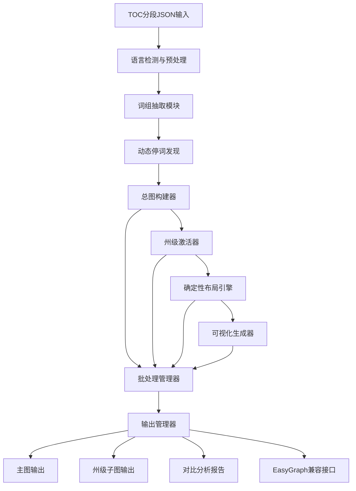

# 设计文档

## 概述

本设计文档描述了语义增强共词网络分析管线的架构和实现方案。该系统基于现有的统计学共现网络基线，通过四个核心改造方向实现升级：确定性布局与可视化稳定性、总图优先的文件结构、词组级节点单位升级、以及动态停词自动发现机制。

系统采用模块化架构，支持从TOC分段文本到高质量网络可视化的完整流程，为后续的语义增强和图融合实验提供坚实基础。

## 架构

### 系统架构图



### 核心组件

#### 1. 输入处理层
- **TOC文档加载器**: 递归扫描并加载TOC分段JSON文件
- **语言检测器**: 自动识别英文/中文文本并选择相应处理策略
- **文本预处理器**: 标准化文本格式，为后续处理做准备

#### 2. 词组抽取层
- **英文词组抽取器**: 基于2-gram和统计约束（PMI/t-score）的短语抽取
- **中文词组抽取器**: 基于jieba分词和邻接词组合的短语生成
- **统计质量评估器**: 使用凝固度/自由度等指标评估短语质量

#### 3. 词汇管理层
- **动态停词发现器**: 基于TF-IDF和文档频率的自动停词识别
- **词表统一器**: 生成全局统一的节点词表和映射关系
- **质量过滤器**: 应用多重约束确保词汇质量

#### 4. 网络构建层
- **总图构建器**: 从全部文档构建全局共现网络
- **州级激活器**: 通过掩码机制从总图提取州级子图
- **共现计算器**: 基于窗口定义计算词组共现关系

#### 5. 布局与可视化层
- **确定性布局引擎**: 使用固定种子的力导向布局算法
- **位置缓存管理器**: 确保节点位置在不同图中保持一致
- **可视化过滤器**: 基于重要性和阈值进行可视化优化

#### 6. 输出管理层
- **结构化输出器**: 生成标准化的中间结果和最终输出
- **对比分析器**: 提供多维度网络结构对比分析
- **兼容性接口**: 为EasyGraph/OpenRank提供标准化数据接口

## 组件和接口

### 核心接口定义

#### 1. 文档处理接口
```python
class DocumentProcessor:
    def load_toc_documents(self, root_directory: str) -> List[TOCDocument]
    def detect_language(self, text: str) -> Language
    def preprocess_text(self, text: str, language: Language) -> ProcessedText
```

#### 2. 词组抽取接口
```python
class PhraseExtractor:
    def extract_english_phrases(self, text: str, k: int = 30) -> List[Phrase]
    def extract_chinese_phrases(self, text: str, k: int = 50) -> List[Phrase]
    def evaluate_phrase_quality(self, phrases: List[Phrase]) -> List[QualityScore]
```

#### 3. 停词管理接口
```python
class StopwordManager:
    def discover_dynamic_stopwords(self, corpus: Corpus) -> List[Stopword]
    def merge_stopword_lists(self, static: List[str], dynamic: List[str]) -> List[str]
    def apply_stopword_filter(self, phrases: List[Phrase], stopwords: List[str]) -> List[Phrase]
```

#### 4. 网络构建接口
```python
class NetworkBuilder:
    def build_global_graph(self, documents: List[TOCDocument]) -> GlobalGraph
    def extract_state_subgraph(self, global_graph: GlobalGraph, state: str) -> StateGraph
    def compute_cooccurrence(self, window: TextWindow) -> CooccurrenceMatrix
```

#### 5. 布局管理接口
```python
class LayoutManager:
    def compute_deterministic_layout(self, graph: Graph, seed: int = 42) -> Layout
    def cache_node_positions(self, layout: Layout) -> PositionCache
    def apply_cached_positions(self, graph: Graph, cache: PositionCache) -> Graph
```

### 数据模型

#### 核心数据结构
```python
@dataclass
class TOCDocument:
    doc_id: str
    state: str
    segments: List[TextSegment]

@dataclass
class TextSegment:
    segment_id: str
    title: str
    level: int
    order: int
    text: str

@dataclass
class Phrase:
    text: str
    frequency: int
    quality_score: float
    language: Language

@dataclass
class GlobalGraph:
    nodes: Dict[str, Node]
    edges: Dict[Tuple[str, str], Edge]
    vocabulary: Vocabulary
    statistics: GraphStatistics

@dataclass
class StateGraph:
    parent_graph: GlobalGraph
    active_nodes: Set[str]
    active_edges: Set[Tuple[str, str]]
    state_id: str
    statistics: GraphStatistics
```

## 数据模型

### 输入数据模型

#### TOC分段JSON格式
```json
{
  "doc_id": "document_identifier",
  "state": "state_code",
  "segments": [
    {
      "segment_id": "unique_segment_id",
      "title": "section_title",
      "level": 1,
      "order": 1,
      "text": "segment_content_text"
    }
  ]
}
```

### 中间数据模型

#### 词组抽取结果
```json
{
  "segment_id": "segment_identifier",
  "language": "en|zh",
  "phrases": [
    {
      "text": "phrase_text",
      "frequency": 10,
      "quality_score": 0.85,
      "extraction_method": "bigram_pmi|segmentation"
    }
  ]
}
```

#### 动态停词列表
```json
{
  "stopwords": [
    {
      "phrase": "stop_phrase",
      "document_frequency": 0.95,
      "tfidf_score": 0.001,
      "removal_reason": "high_df|low_tfidf"
    }
  ],
  "statistics": {
    "total_phrases": 10000,
    "removed_count": 2000,
    "retention_rate": 0.8
  }
}
```

### 输出数据模型

#### 网络节点格式
```csv
node_id,phrase,frequency,centrality_degree,centrality_pagerank,tfidf_weight
node_001,student_safety,150,12,0.025,0.45
node_002,academic_policy,89,8,0.018,0.32
```

#### 网络边格式
```csv
source,target,weight,cooccurrence_count,normalized_weight
node_001,node_002,5,5,0.15
node_002,node_003,3,3,0.09
```

#### 布局缓存格式
```json
{
  "layout_algorithm": "force_directed_deterministic",
  "seed": 42,
  "positions": {
    "node_001": {"x": 0.25, "y": 0.75},
    "node_002": {"x": 0.60, "y": 0.30}
  },
  "parameters": {
    "k": 2.0,
    "iterations": 50,
    "edge_weight_influence": 0.8
  }
}
```

## 正确性属性

*属性是一个特征或行为，应该在系统的所有有效执行中保持为真——本质上是关于系统应该做什么的正式陈述。属性作为人类可读规范和机器可验证正确性保证之间的桥梁。*

### 属性1：布局确定性
*对于任何*给定的网络图和固定种子，多次运行布局算法应该产生相同的节点位置坐标
**验证：需求 1.1**

### 属性2：可视化过滤一致性
*对于任何*网络图，应用边权阈值和节点重要性过滤后，结果图中的所有边权应该大于等于阈值，所有显示的节点应该满足重要性条件
**验证：需求 1.3**

### 属性3：节点位置缓存一致性
*对于任何*节点，在总图和所有州级子图中，该节点的位置坐标应该完全相同
**验证：需求 1.4, 2.4, 6.4**

### 属性4：标注分层正确性
*对于任何*网络可视化，节点标注的显示优先级应该与其度中心性、PageRank或TF-IDF权重的排序一致
**验证：需求 1.5**

### 属性5：总图包含性
*对于任何*州级子图，其所有节点和边都应该存在于总图中
**验证：需求 2.1, 2.2**

### 属性6：子图激活正确性
*对于任何*州级子图，其包含的节点和边应该只来自该州的文档窗口
**验证：需求 2.2, 6.1**

### 属性7：词表统一性
*对于任何*子图节点，都应该存在于总图的统一词表中，且具有相同的node_id映射
**验证：需求 2.3, 5.4**

### 属性8：孤立节点保留
*对于任何*图构建过程，孤立节点应该被显式保留在最终图结构中
**验证：需求 2.5**

### 属性9：英文2-gram生成
*对于任何*英文文本段，词组抽取应该产生2-gram（双词）短语作为主要候选
**验证：需求 3.1**

### 属性10：统计约束筛选
*对于任何*短语候选集，经过统计约束筛选后的短语应该满足最小互信息、t-score或凝固度阈值
**验证：需求 3.2**

### 属性11：中文分词处理
*对于任何*中文文本段，应该首先进行分词处理，然后基于分词结果进行短语抽取
**验证：需求 3.3**

### 属性12：非LLM依赖性
*对于任何*文本处理任务，系统应该在不使用LLM工具的情况下正常完成基本功能
**验证：需求 3.5**

### 属性13：多词短语扩展性
*对于任何*短语抽取配置，系统应该支持从2-gram扩展到更长的多词短语
**验证：需求 3.6**

### 属性14：TF-IDF计算正确性
*对于任何*语料库，系统应该为每个短语正确计算TF-IDF值，且值域在合理范围内
**验证：需求 4.1**

### 属性15：动态停词识别准确性
*对于任何*识别为动态停词的短语，其文档频率应该高于阈值且TF-IDF值应该低于阈值
**验证：需求 4.2**

### 属性16：停词表合并完整性
*对于任何*合并后的停词表，应该包含所有静态停词和动态停词，且无重复
**验证：需求 4.4**

### 属性17：停词过滤彻底性
*对于任何*最终网络，其节点集合不应该包含停词表中的任何短语
**验证：需求 4.5**

### 属性18：JSON格式解析正确性
*对于任何*符合TOC分段格式的JSON文件，系统应该正确解析所有必需字段（segment_id, title, level, order, text）
**验证：需求 5.1**

### 属性19：窗口边界一致性
*对于任何*共现计算，应该严格按照segment边界定义窗口，不跨越segment计算共现
**验证：需求 5.2**

### 属性20：语言处理流程完整性
*对于任何*文本段，应该根据其语言类型完整执行相应的规范化、分词、短语抽取、停词过滤流程
**验证：需求 5.3**

### 属性21：节点映射唯一性
*对于任何*短语，在phrase → node_id映射表中应该有唯一的映射关系
**验证：需求 5.4**

### 属性22：共现关系无向性
*对于任何*共现边，应该是无向的，即(A,B)和(B,A)表示同一条边
**验证：需求 5.5**

### 属性23：权重计算可配置性
*对于任何*共现边，系统应该支持二值共现、计数型或距离衰减等不同权重计算方式
**验证：需求 5.6**

### 属性24：子图重加权正确性
*对于任何*州级子图的边权，应该只来自该州窗口的共现累加，不包含其他州的贡献
**验证：需求 6.2**

### 属性25：诱导子图结构正确性
*对于任何*从总图提取的诱导子图，其结构应该保持总图中相应节点和边的所有关系
**验证：需求 6.3**

### 属性26：批处理完整性
*对于任何*toc_doc文件夹，系统应该能够处理其中的所有JSON文件，不遗漏任何有效文档
**验证：需求 7.1**

### 属性27：网络统计指标正确性
*对于任何*网络图，计算的节点数、边数、密度、孤立点比例等统计指标应该与实际图结构一致
**验证：需求 8.4**

### 属性28：高级网络指标准确性
*对于任何*连通网络，计算的连通分量、聚类系数、平均路径长度、中心性排序应该符合图论定义
**验证：需求 8.5**

## 错误处理

### 输入错误处理

#### 文件格式错误
- **JSON格式错误**: 记录错误文件路径，跳过该文件，继续处理其他文件
- **缺失必需字段**: 记录缺失字段信息，使用默认值或跳过该记录
- **编码错误**: 尝试多种编码格式，失败时记录错误并跳过

#### 数据质量问题
- **空文本段**: 记录空文本段数量，从处理中排除
- **异常字符**: 清理或替换异常字符，记录清理操作
- **语言检测失败**: 使用默认语言（英文）处理，记录检测失败

### 处理错误处理

#### 词组抽取错误
- **NLTK/jieba不可用**: 自动切换到内置fallback方法
- **统计计算失败**: 使用简化的频率统计替代
- **内存不足**: 分批处理大文档，记录处理进度

#### 网络构建错误
- **图构建失败**: 降低复杂度重试，记录失败原因
- **布局计算超时**: 使用简化布局算法，记录超时信息
- **可视化生成失败**: 生成文本报告替代图像输出

### 输出错误处理

#### 文件写入错误
- **磁盘空间不足**: 清理临时文件，压缩输出格式
- **权限错误**: 尝试替代输出路径，记录权限问题
- **文件锁定**: 等待重试或使用临时文件名

#### 格式兼容性错误
- **EasyGraph格式不兼容**: 提供多种输出格式选项
- **编码问题**: 使用UTF-8编码，处理特殊字符
- **版本兼容性**: 记录格式版本信息，提供转换工具

## 测试策略

### 双重测试方法

本系统采用单元测试和基于属性的测试相结合的综合测试策略：

#### 单元测试
- **具体示例验证**: 测试特定输入的预期输出
- **边界条件测试**: 验证空输入、极大输入等边界情况
- **错误条件测试**: 确保错误输入得到适当处理
- **集成点测试**: 验证组件间接口的正确性

#### 基于属性的测试
- **通用属性验证**: 验证在所有输入上都应该成立的属性
- **随机输入覆盖**: 通过随机生成的输入发现边界情况
- **不变量检查**: 确保系统不变量在所有操作中保持
- **往返属性测试**: 验证序列化/反序列化等往返操作的一致性

### 测试框架配置

#### 基于属性的测试设置
- **测试库**: 使用Hypothesis进行Python基于属性的测试
- **迭代次数**: 每个属性测试最少运行100次迭代
- **测试标记**: 每个属性测试使用注释标记对应的设计属性
- **标记格式**: `# Feature: semantic-coword-pipeline, Property {number}: {property_text}`

#### 测试数据生成策略
- **智能生成器**: 编写约束到输入空间的智能生成器
- **现实数据模拟**: 生成符合TOC文档格式的测试数据
- **边界值包含**: 确保生成器覆盖边界和异常情况
- **语言多样性**: 生成英文和中文的混合测试数据

### 测试覆盖范围

#### 功能测试覆盖
- **词组抽取**: 英文2-gram和中文分词短语的正确性
- **停词发现**: 动态停词识别的准确性和完整性
- **网络构建**: 总图和子图构建的结构正确性
- **布局稳定性**: 确定性布局和位置缓存的一致性
- **输出格式**: 所有输出文件的格式和内容正确性

#### 性能测试覆盖
- **大规模数据**: 测试处理大量文档的性能和稳定性
- **内存使用**: 监控内存使用情况，防止内存泄漏
- **处理时间**: 确保处理时间在可接受范围内
- **并发安全**: 验证多进程处理的数据一致性

#### 兼容性测试覆盖
- **依赖可选性**: 测试在缺少NLTK/jieba时的fallback行为
- **格式兼容**: 验证与EasyGraph/OpenRank的数据格式兼容性
- **平台兼容**: 确保在不同操作系统上的一致行为
- **版本兼容**: 测试不同Python版本的兼容性